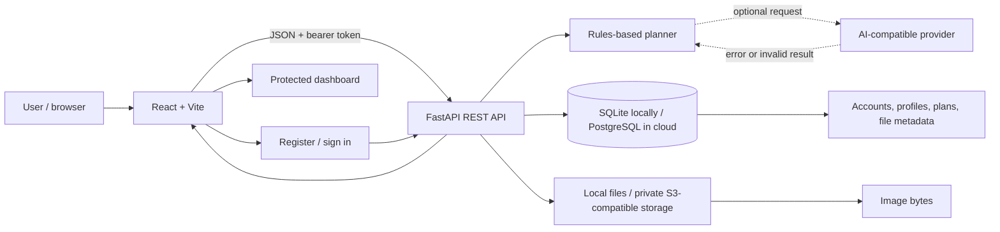

# 🍽️ Goodplate: AI-Powered Personal Diet Planner with Cloud Storage

A full-stack cloud-computing course project for creating general-wellness meal examples, saving private plans, and storing demo meal images. It runs locally with SQLite and local files; PostgreSQL and S3-compatible object storage can be enabled with environment variables. Plan generation works without AI credentials and falls back to a deterministic rules engine.

## At a glance

- React 19 + Vite frontend with direct `/login` and `/signup` pages
- FastAPI REST backend with OpenAPI docs
- Password hashing, signed expiring tokens, and owner-scoped profile/plan/file operations
- SQLite locally or PostgreSQL through `DATABASE_URL`
- Local file storage or a private S3-compatible bucket
- Diet/allergy-aware rule-based meal suggestions, optional AI-compatible provider with output validation and local fallback
- Python `unittest` integration suite, Oxlint, production build, GitHub Actions CI, and backend Dockerfile

## Architecture



A signed-in browser sends its bearer token to the API. The API derives the account ID from the verified token, validates profile changes, generates and saves plans under that owner, and writes images under user-scoped object keys. The database contains structured records and object metadata; storage contains file bytes. See [docs/ARCHITECTURE.md](docs/ARCHITECTURE.md) for the full data flow, schema, cloud-concept mapping, deployment options, and scaling notes. See [docs/PROJECT_REPORT.md](docs/PROJECT_REPORT.md) for the course-report material, test matrix, screenshot checklist, and interview preparation.

## 📊 Structure

```text
.
├── backend/app/                 API, SQL models, auth, planner and storage adapters
├── backend/tests/               API integration tests
├── backend/requirements*.txt    Local and optional cloud dependencies
├── backend/.env.example         Backend configuration template
├── docs/                        Architecture and project report
├── public/                      Static web assets
├── screenshots/                 Safe screenshot checklist
├── sample_data/                 Synthetic-data policy
├── src/                          React app, pages, styles and API client
├── Dockerfile                    Backend container
├── .github/workflows/ci.yml      Build/lint/test checks
└── README.md
```


## Configuration

Copy the examples to local untracked env files or use your deployment platform's secret manager. `backend/app/main.py` loads `backend/.env` before creating its database engine.

| Variable | Purpose |
|---|---|
| `JWT_SECRET` | Required in production; generate a random secret and keep it server-side |
| `APP_ENV` | Set to `production` on the deployed API |
| `DATABASE_URL` | Optional managed PostgreSQL URL; otherwise local SQLite |
| `DATABASE_PATH` | Local SQLite path, default `data/diet_planner.db` |
| `FRONTEND_ORIGINS` | Exact comma-separated browser origins allowed by API CORS |
| `LOCAL_STORAGE_PATH` | Local uploads path, default `data/uploads` |
| `S3_BUCKET`, `S3_ENDPOINT_URL`, `S3_REGION` | Enable S3-compatible object storage |
| `S3_ACCESS_KEY_ID`, `S3_SECRET_ACCESS_KEY` | Server-only storage credentials |
| `AI_API_URL`, `AI_API_KEY`, `AI_MODEL` | Optional OpenAI-compatible chat-completions provider; server-only key |
| `VITE_API_BASE_URL` | Frontend API URL; defaults to `http://localhost:8000/api` |

Never put API credentials, database passwords, or `JWT_SECRET` in a `VITE_*` variable. `.env`, `.env.local`, databases, uploads, and virtual environments are ignored by Git. The tracked `.env.example` files contain placeholders only.

## API routes

Protected routes require `Authorization: Bearer <access_token>`.

| Method | Path | Purpose |
|---|---|---|
| `GET` | `/api/health` | Health check |
| `POST` | `/api/auth/register` | Create account (`201`; duplicate email `409`) |
| `POST` | `/api/auth/login` | Sign in (`401` on invalid credentials) |
| `POST` | `/api/auth/logout` | Client logout; browser removes its token |
| `GET`, `PUT` | `/api/profile` | Read/update own profile |
| `POST`, `GET` | `/api/plans` | Generate/save or list own plans |
| `GET`, `DELETE` | `/api/plans/{id}` | Read/delete an owned plan |
| `POST` | `/api/files` | Upload JPEG/PNG/WebP image up to 5 MB |
| `GET` | `/api/files` | List own file metadata |
| `GET` | `/api/files/{id}/download` | Download an owned image |
| `DELETE` | `/api/files/{id}` | Delete an owned image |

## 🔐Security and limitations

The API uses salted PBKDF2-HMAC-SHA256 password hashes, signed expiring bearer tokens, input validation, owner-scoped database queries, restricted image type/signature/size checks, configurable CORS, and server-side secrets. This learning implementation is not production identity software. Logout clears the browser token but cannot revoke a copied stateless token before expiry. Public deployment needs managed OIDC or token revocation/rotation, rate limiting, account recovery, migrations, redacted logs, backups/restore tests, monitoring, and abuse controls.

The sample meal catalog and calorie/macro numbers are illustrative and incomplete. Allergy exclusions are not a guarantee against cross-contamination. No daily intake tracker, coach role, verified food database, clinical validation, live cloud deployment, or automatic backup system is included.

## 👨‍💻 Author :
Shresthaa Maiti
