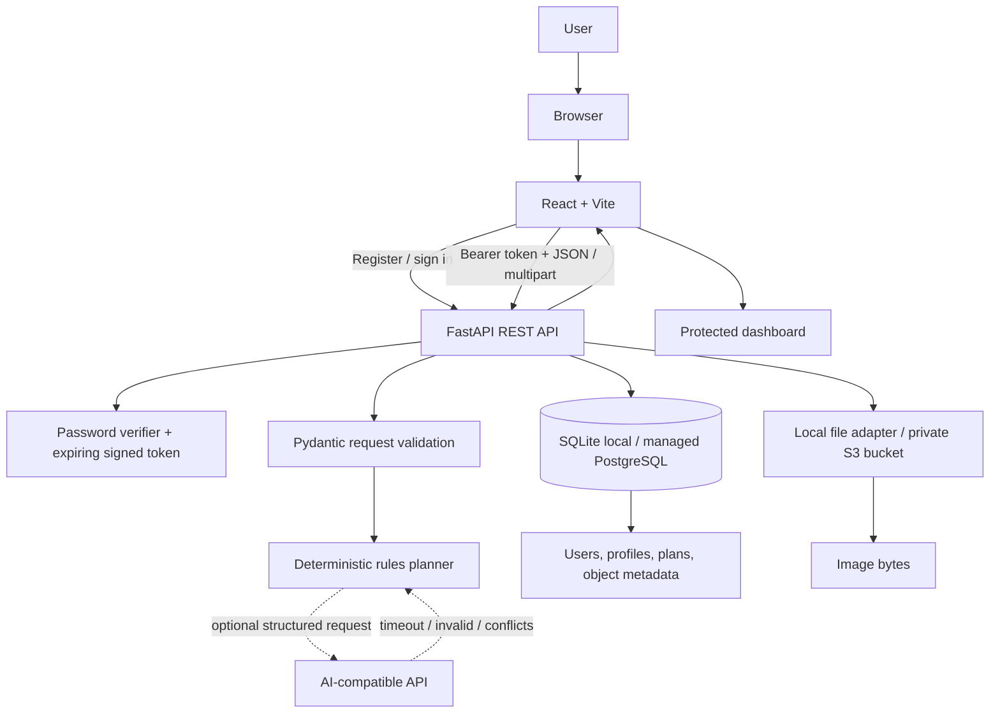

# Architecture and Cloud Computing Guide

## Recommended student stack

| Layer | Selected implementation | Local mode | Deployment mode |
|---|---|---|---|
| Web client | React 19 + Vite | Vite dev server | Static hosting/CDN |
| API | FastAPI, REST, OpenAPI | Uvicorn on port 8000 | Container host such as Cloud Run/App Runner |
| Authentication | API-issued signed bearer token; PBKDF2 password hashes | Same local API | Use a strong secret manager value; consider Cognito/Firebase Auth for a production identity boundary |
| Structured persistence | SQLAlchemy models | SQLite | PostgreSQL via `DATABASE_URL` |
| File persistence | Private storage adapter | Local `data/uploads` | S3-compatible bucket |
| Meal suggestions | Curated rule engine | Always available | Optional AI-compatible provider with validation and local fallback |
| CI | GitHub Actions | Local build and `unittest` | Same checks before deploy |

This is Option B (recommended) with cost-free local services as its baseline. Firestore and Firebase Storage were initial alternatives in the project brief; this implementation instead uses a relational schema and S3-compatible object storage so the same Python backend can run locally or on multiple cloud providers without Firebase-specific client credentials.

## Architecture diagram

## Data flow

1. The browser sends registration or login credentials to `/api/auth/register` or `/api/auth/login` over HTTPS in a hosted setup.
2. The API validates input, hashes new passwords with PBKDF2-HMAC-SHA256, verifies existing hashes with constant-time comparison, and returns an expiring signed access token.
3. The React client keeps the token in session storage and sends it as a bearer token. The API validates its signature and expiry, resolves the user, and rejects unauthenticated calls.
4. Profile input is validated and stored on the matching user row. Profile values affect the example choices only; they do not produce diagnosis or clinical targets.
5. Plan generation filters a bundled meal catalog by selected diet and known allergen tags. If both `AI_API_URL` and `AI_API_KEY` are set, the backend sends only the required preference fields. It validates structure, calories, and diet/allergy conflicts; provider errors or invalid results fall back to local rules.
6. A generated plan and timestamps are stored in the relational database with its owner ID. Reads, updates, and deletes always filter by both record ID and authenticated owner ID.
7. An uploaded image is limited to JPEG, PNG, or WebP and 5 MB; content signatures are checked. Bytes are written beneath an owner-scoped object key. The database stores file name, key, media type, byte count, and owner ID.
8. The dashboard retrieves profile, plans, and file metadata through protected API calls. Download requests verify ownership before reading image bytes from the storage adapter.

## Database schema

| Table | Fields | Relationships/purpose |
|---|---|---|
| `users` | `id` UUID string primary key, `email` unique/indexed, `name`, `password_hash`, `profile` JSON, `created_at` | Account; one-to-many to plans and files |
| `plans` | `id` UUID string primary key, `user_id` foreign key/index, `data` JSON, `created_at` | One generated plan belongs to exactly one user |
| `user_files` | `id` UUID string primary key, `user_id` foreign key/index, `filename`, `object_key` unique, `content_type`, `size_bytes`, `created_at` | Metadata for bytes stored in local object directory or S3 |

Profile JSON contains name, optional age/height/weight, activity level, dietary preference, general goal, allergy labels, and optional meal preferences. Meal data is kept as JSON because the planner creates structured but evolving response objects. For a larger production system, normalize food items, plan meals, macros, and intake events into dedicated tables and use versioned migrations. There is no intake tracker in this MVP; daily tracker and progress-history items in the original brief are future work.

Foreign keys express ownership relationships. API queries add the authenticated owner ID even when looking up a primary key. In PostgreSQL, also enable database-level row security or equivalent policies if direct database access paths are introduced.

## Cloud-computing concepts, mapped to this repository

| Concept | Where it appears | What it demonstrates / limit |
|---|---|---|
| Cloud computing | Hosted React static site, API container, managed database, object bucket | On-demand network services replace a single local machine; local adapters simulate the same contracts |
| SaaS | The hosted browser-based planner | User consumes a complete application; the local version alone is not SaaS |
| PaaS | Managed app/container hosting, managed PostgreSQL, static hosting | Provider handles runtime/patching and platform capacity |
| IaaS | Optional VM/container host/network/storage infrastructure | Lower-level infrastructure is not required by the baseline |
| Client-server | `src/services/api.js` calling `backend/app/main.py` | Browser is the client; FastAPI handles trusted logic and persistence |
| REST API | `/api/auth`, `/api/profile`, `/api/plans`, `/api/files` | HTTP methods/resources and JSON; OpenAPI docs at `/docs` |
| Authentication | `backend/app/security.py`, auth routes | Account verification and expiring bearer tokens |
| Authorization / isolation | `current_user` plus owner-filtered queries in `backend/app/main.py` | User A cannot use ordinary API operations to read User B's plans/files |
| Cloud database | SQLAlchemy models plus configurable `DATABASE_URL` | SQLite locally; PostgreSQL when deployed; central profile/plan/file metadata |
| Object storage | `backend/app/storage.py` | Local object directory by default; optional private S3-compatible bucket for bytes |
| Serverless | Optional hosting with scale-to-zero/serverless containers | Not implemented as functions; can be an API deployment target |
| API gateway | Could front the deployed API with API Gateway/Cloud Endpoints | No separate gateway is bundled in the local stack |
| Scalability / elasticity | Stateless API routes, managed PostgreSQL, external object storage | Horizontal API replicas are possible; production still needs pooling, rate limits, and load testing |
| Load balancing | Cloud container platform or load balancer in front of replicas | Platform-level deployment configuration, not a local component |
| Availability | Managed platform health checks and multi-zone services | Local SQLite process has no high availability; hosted guarantees depend on selected tier |
| Environment variables | `backend/.env.example`, root `.env.example` | Separates endpoints/configuration from code |
| Secrets management | Platform secret store for JWT/AI/S3 keys | Example values are not real secrets; never expose secrets through `VITE_*` variables |
| Cloud security | HTTPS, exact CORS origins, private bucket, server-side ownership checks | Public deployment must add rate limiting, monitoring, backups, and mature identity controls |
| Logging/monitoring | Uvicorn/platform stdout and `/api/health` | No metrics dashboard or alerting is included in the starter |
| CI/CD | `.github/workflows/ci.yml` | Checks frontend build and backend tests; deployment step is intentionally separate |
| CDN | Static frontend host's edge cache | Publish only built static assets; API/data remain access-controlled |
| Queue | Not in the MVP | Add a queue if expensive AI requests, imports, or image processing become asynchronous |

## Three implementation options

### Option A: Beginner/local simulation

- **Architecture:** HTML/CSS/JavaScript → Flask → SQLite → rules engine → local folders.
- **Difficulty:** Low.
- **Cost:** Free on one machine; hosting options and persistent disks vary.
- **Concepts:** Client/server, HTTP, relational database, local file-storage abstraction.
- **Expected output:** A working single-server demo; little cloud-service evidence.

### Option B: Recommended / implemented

- **Architecture:** React/Vite → FastAPI REST API → local SQLite or managed PostgreSQL; local file adapter or S3-compatible storage; local rules engine with optional remote AI fallback. This repository implements this path.
- **Difficulty:** Moderate and portfolio-friendly.
- **Cost:** Free locally. Hosted free tiers/credits may be available but quotas, sleeping, storage limits, and eligibility change.
- **Concepts:** Authentication, API boundaries, user isolation, managed data services, object storage, environment configuration, CI and container deployment.
- **Expected output:** A reusable full-stack demo that runs without cloud credentials and can be configured for hosted services.

### Option C: Advanced managed-cloud architecture

- **Architecture:** React/Next.js on CDN → API Gateway → container/serverless FastAPI → managed identity provider → managed PostgreSQL/NoSQL → private object bucket → AI service/queue → monitoring.
- **Difficulty:** High; needs IAM, networking, deployment, quota, and cost controls.
- **Cost:** Can incur costs quickly. Set budgets/alerts and destroy unused resources.
- **Concepts:** IAM, VPC/network boundaries, autoscaling, load balancing, managed identity, private networking, queues, observability, backups, and disaster recovery.
- **Expected output:** A cloud architecture demonstration with deployment automation and production-like service boundaries, not a medical product.

## Deployment options

### A. Student-friendly hosted deployment

1. **Frontend:** Build with `npm ci && npm run build`; publish `dist/` to Cloudflare Pages or Firebase Hosting. Add `VITE_API_BASE_URL` as a build variable.
2. **API:** Build the root `Dockerfile` and deploy to Cloud Run or another container host. Install `backend/requirements-cloud.txt` for PostgreSQL/S3 providers.
3. **Database:** Provision managed PostgreSQL; add its URL only in the API host's secret/config settings.
4. **Object storage:** Provision a private S3-compatible bucket (for example, R2); configure endpoint, bucket, region, and server-side access credentials.
5. **Authentication:** This starter currently validates its own signed bearer tokens. For stronger production authentication, migrate to Firebase Authentication or a managed OIDC provider and verify provider-issued tokens server-side; do not treat client-only Firebase state as API authorization.
6. **Security/config:** Generate a high-entropy `JWT_SECRET`; set `APP_ENV=production`; allow only the exact static-host origin in `FRONTEND_ORIGINS`; enable HTTPS and private bucket policies.
7. **Operations:** Use host logs, `/api/health` probes, provider usage dashboards, backups, and cost alerts. Verify persistent database and object storage after a redeploy.

Free-tier status and resource limits change. Do not assume a provider's free tier includes always-on compute, durable disk, outbound traffic, or free AI requests.

### B. AWS mapping

- Static frontend: Amplify Hosting or S3 + CloudFront.
- API: App Runner or ECS Fargate; alternatively API Gateway + Lambda after adapting the ASGI app.
- Managed relational data: RDS PostgreSQL.
- Object storage: private S3 bucket with block-public-access enabled and least-privilege IAM role.
- Authentication: Amazon Cognito, after replacing/bridging the starter token flow with server-side Cognito JWT verification.
- Secrets and monitoring: Secrets Manager/Parameter Store, CloudWatch logs/alarms, health check, budgets.
- Network: HTTPS ingress, private database subnet, security groups, restricted outbound paths as needed.

The same concepts map to Azure Container Apps + Azure Database for PostgreSQL + Blob Storage + Entra External ID/Key Vault/Monitor, or Google Cloud Run + Cloud SQL + Cloud Storage + Identity Platform/Secret Manager/Cloud Logging. Select one cloud; do not provision all provider equivalents for a course demo.

## Security notes before public deployment

- Use HTTPS only; encryption in transit is provided by the hosting edge and database/storage TLS configuration.
- Managed database/object-storage encryption at rest must be confirmed in the chosen cloud account.
- The included token is stateless; logout deletes the browser session but does not revoke an already copied token before its expiry. Use shorter lifetimes, refresh-token rotation/revocation, or managed OIDC for public use.
- Add rate limiting for login, registration, uploads, and plan generation. Add email verification, password reset, logging redaction, and database migrations.
- Keep buckets private. Prefer short-lived signed download URLs only if your product needs them; current downloads proxy through the owner-checked API.
- Restrict image formats and size as implemented, but also add malware scanning and content moderation before accepting public uploads.
- Set backup/restore policy and test restoration. Do not log passwords, access tokens, upload contents, or provider keys.

## Scale discussion

- **10 users:** One modest API instance, SQLite/local files for a classroom demo, or small managed PostgreSQL plus object bucket. Validate the end-to-end path and backups.
- **1,000 users:** Put API replicas behind a managed load balancer, move to managed PostgreSQL with connection pooling and indexes, add request/rate limits, CDN-cache static assets, and keep uploads in object storage. Measure plan-generation latency and database pool usage.
- **100,000 users:** Separate identity from application records, use autoscaling stateless APIs, managed database read replicas/partitioning where measured, CDN for static assets, object lifecycle policies, queues for costly AI/image work, caching for public/static food catalog data, request budgets, tracing, and multi-zone recovery. Run load tests and model provider quotas/cost before increasing traffic.

For interviews: describe current implemented controls separately from a proposed scale architecture. Do not claim that local tests prove multi-region availability or production capacity.
